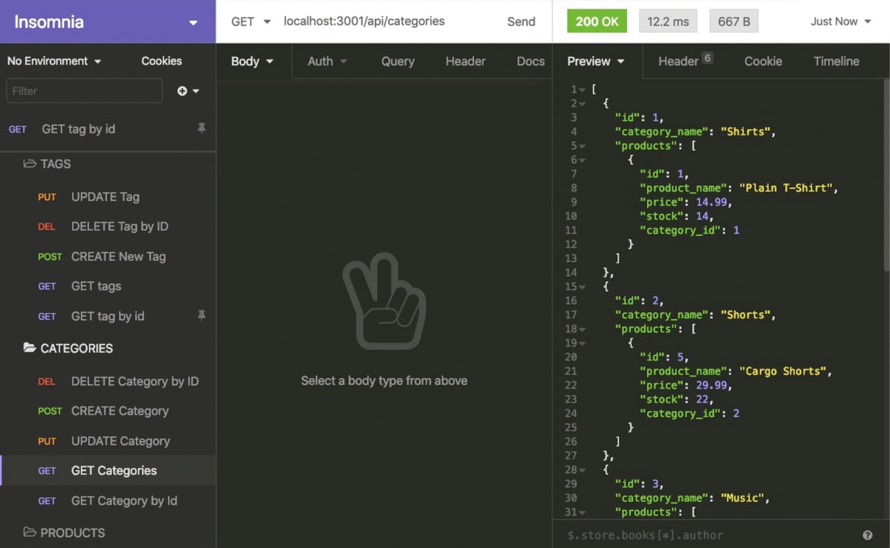

# ecommerce-backend

## Description

This challenge demonstrates the structure to build the back end for an e-commerce site by modifying starter code. Configure a working Express.js API to use Sequelize to interact with a MySQL database.

## Tasks
- connect to a database using sequelize after added a database name, mysql username, and mysql password.
- When entering schema and seeds commands, then a development database is created and is seeded with test data.
- When i test API POST, PUT, and DELETE routes in Insomnia, then I am able to successfuly create, update and delete data in my database.

## Usage

- Link to Deployed Application: N/A
- Github Repo: https://github.com/izbeloro/ecommerce-backend
- Video Walkthrough: https://drive.google.com/file/d/1R9FFKNKsdbRfJsTxQJji0xNjPKi6IRm8/view

To use this challenge, you have to run node. After running node, you are able to post, put, and delete through insomnia. Insomnia allows you to edit the database.

## Credits

- https://www.makeareadme.com/#license-1
- https://stackoverflow.com/questions/35525069/npm-install-command-not-working
- https://learn.microsoft.com/en-us/troubleshoot/sql/database-engine/connect/error-message-when-you-connect

## License

MIT License

Copyright (c) [2023] [SamanthaOrozco]

Permission is hereby granted, free of charge, to any person obtaining a copy
of this software and associated documentation files (the "Software"), to deal
in the Software without restriction, including without limitation the rights
to use, copy, modify, merge, publish, distribute, sublicense, and/or sell
copies of the Software, and to permit persons to whom the Software is
furnished to do so, subject to the following conditions:

The above copyright notice and this permission notice shall be included in all
copies or substantial portions of the Software.

THE SOFTWARE IS PROVIDED "AS IS", WITHOUT WARRANTY OF ANY KIND, EXPRESS OR
IMPLIED, INCLUDING BUT NOT LIMITED TO THE WARRANTIES OF MERCHANTABILITY,
FITNESS FOR A PARTICULAR PURPOSE AND NONINFRINGEMENT. IN NO EVENT SHALL THE
AUTHORS OR COPYRIGHT HOLDERS BE LIABLE FOR ANY CLAIM, DAMAGES OR OTHER
LIABILITY, WHETHER IN AN ACTION OF CONTRACT, TORT OR OTHERWISE, ARISING FROM,
OUT OF OR IN CONNECTION WITH THE SOFTWARE OR THE USE OR OTHER DEALINGS IN THE
SOFTWARE.